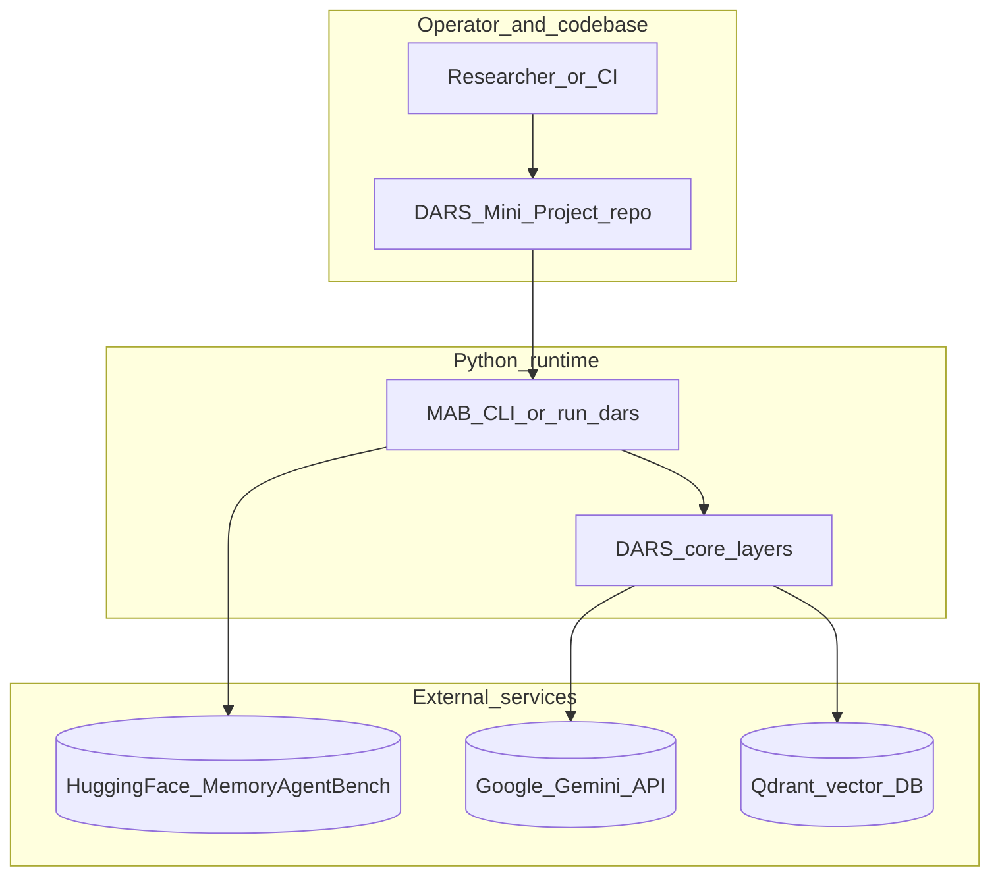
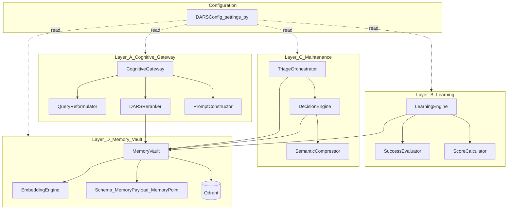
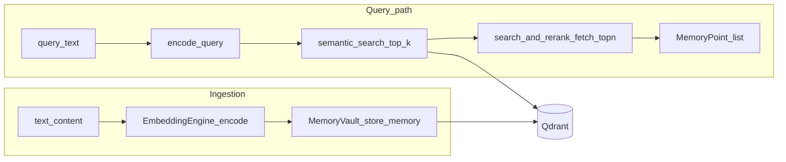
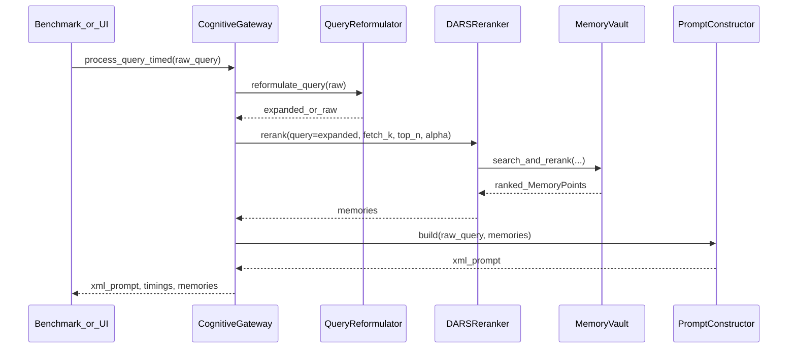
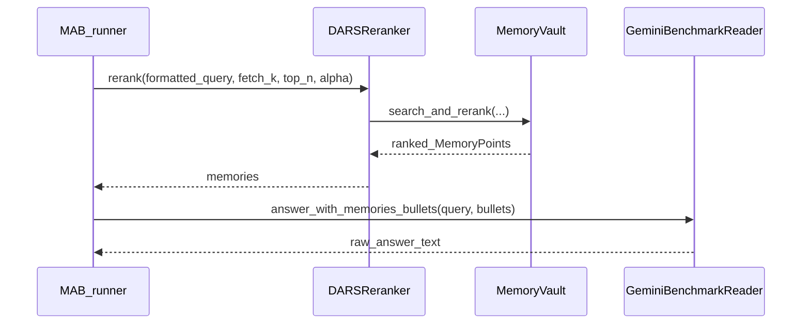
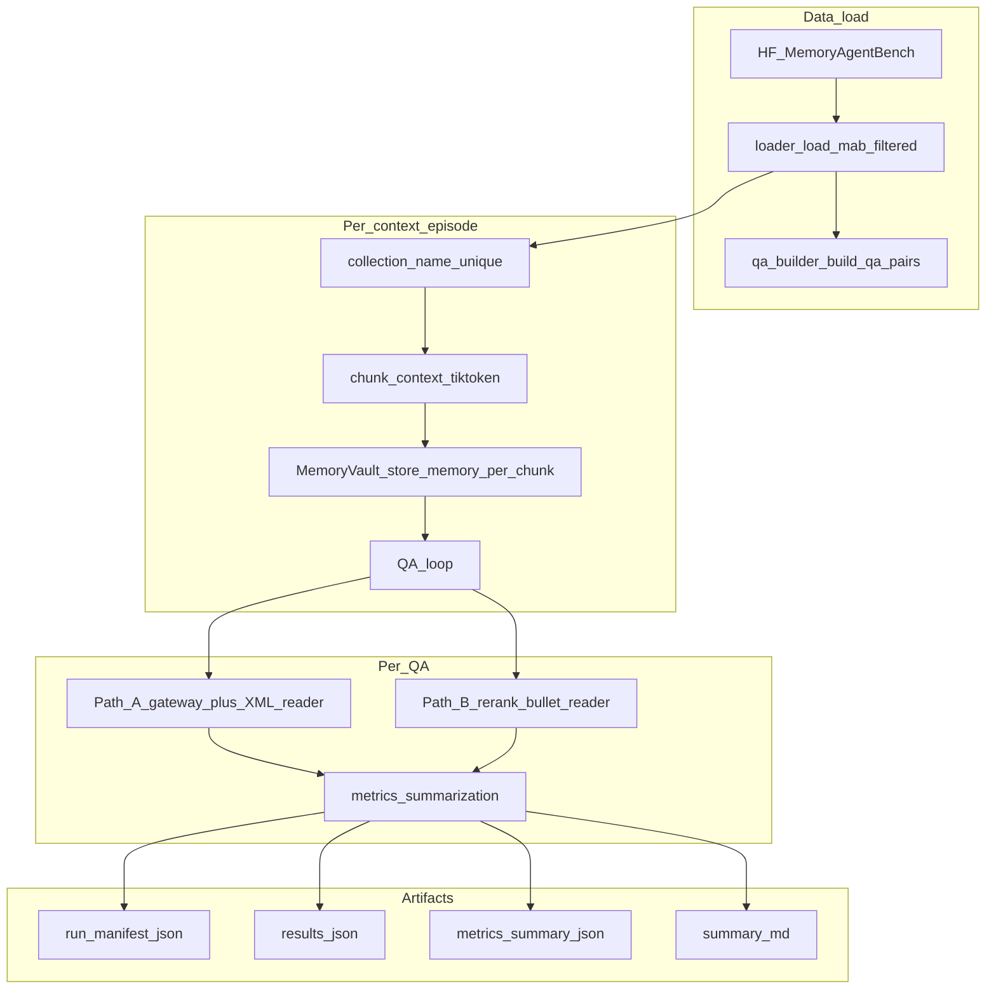
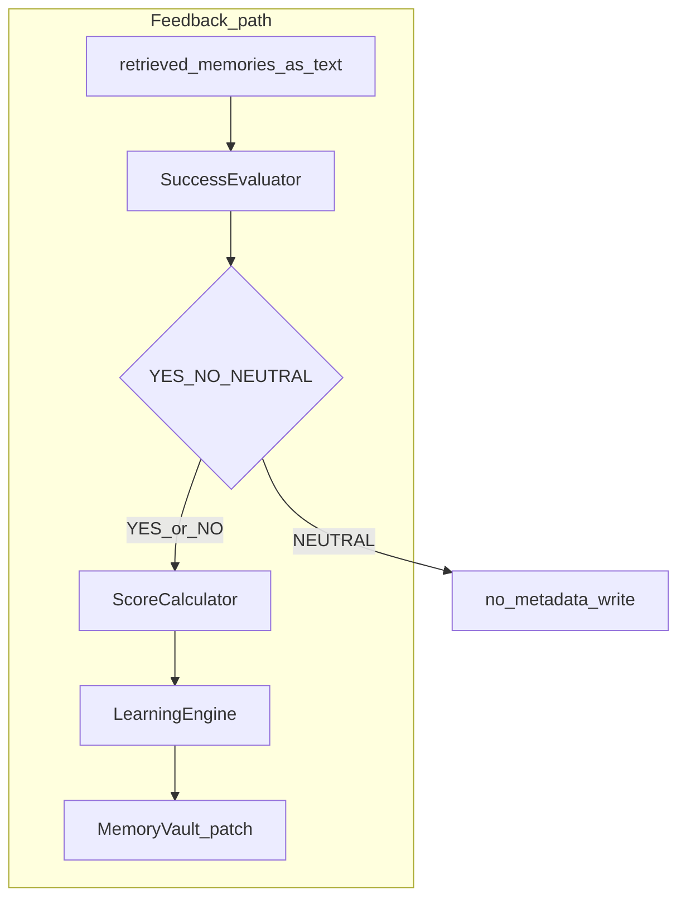
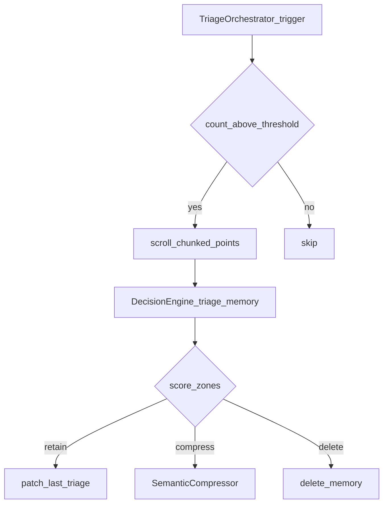
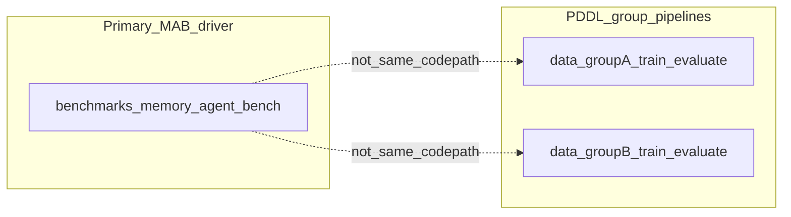

# DARS Research Architecture — Diagrams and Reference

This document provides **publication-style** architecture views for the **Dynamic Adaptive Retention Scoring (DARS)** codebase: ecosystem context, four-layer runtime, Layer D retrieval internals, **Path A vs Path B** query pipelines (including MemoryAgentBench), learning and maintenance loops, and a **glossary** mapping every major diagram element to source files.

**Companion:** Full mathematical and contract specification remains in [Architecture.md](Architecture.md).

**Rendering:** Mermaid diagrams render on GitHub and in many Markdown previews (VS Code “Open Preview”). If a diagram fails to render, check for corporate firewall stripping of diagram blocks.

---

## Figure index

| ID | Title | Section |
|----|--------|---------|
| F1 | Ecosystem and external dependencies | §1 |
| F2 | Four-layer logical architecture and policy boundaries | §2 |
| F3 | Layer D — vault, embedding, search, hybrid rerank | §3 |
| F4 | Path A — CognitiveGateway query pipeline (sequence) | §4 |
| F5 | Path B — Rerank-only + bullet reader (sequence, MAB) | §5 |
| F6 | MemoryAgentBench driver — end-to-end evaluation pipeline | §6 |
| F7 | Layer B — post-response learning loop | §7 |
| F8 | Layer C — maintenance triage lifecycle | §8 |
| F9 | Auxiliary research data paths (Group A / Group B) | §9 |

**Legend (edges):** Solid arrows indicate primary **data** or **control** flow. Dashed lines in F2 indicate **configuration** injection from `DARSConfig`. Layer A does **not** write vectors; Layer B/C mutate **payload metadata** or lifecycle state **only** through Layer D APIs.

---

## 1. Ecosystem and external dependencies (F1)

**Narrative:** The Python runtime orchestrates **DARS** against **Qdrant** (vector persistence) and **Google Gemini** (optional LLM calls for reformulation, benchmark reading, evaluation, compression). MemoryAgentBench evaluation additionally pulls **Hugging Face** tabular data.

### F1 element reference

| Element | Role |
|---------|------|
| `Researcher_or_CI` | Runs `python -m benchmarks.memory_agent_bench`, tests, or `run_dars.py`. |
| `DARS_Mini_Project_repo` | Source under `config/`, `core/`, `benchmarks/`, `tests/`, `third_party/`. |
| `MAB_CLI_or_run_dars` | [`benchmarks/memory_agent_bench/__main__.py`](benchmarks/memory_agent_bench/__main__.py) or [`run_dars.py`](run_dars.py). |
| `DARS_core_layers` | Layers A–D under [`core/`](core/). |
| `HuggingFace_MemoryAgentBench` | Dataset `ai-hyz/MemoryAgentBench` via [`benchmarks/memory_agent_bench/loader.py`](benchmarks/memory_agent_bench/loader.py). |
| `Google_Gemini_API` | HTTP `generateContent`; governed by [`core/gemini_transport.py`](core/gemini_transport.py). |
| `Qdrant_vector_DB` | Collections per MAB episode; [`core/layer_d/storage.py`](core/layer_d/storage.py). |

---

## 2. Four-layer logical architecture (F2)

**Narrative:** **Layer A** prepares queries and reads memory **read-only**. **Layer B** updates **metadata** after judged outcomes. **Layer C** runs **retain / compress / delete** policies. **Layer D** owns **vectors + payloads + scoring + retrieval**.

### F2 policy summary

| Layer | May read vault | May mutate vectors | May patch payload fields |
|-------|----------------|----------------------|---------------------------|
| A | Yes | No | No |
| B | Yes | No | Yes (via `patch_payload` / update APIs) |
| C | Yes | Delete / compress text | Yes |
| D | Yes | Yes (upsert / delete) | Yes |

---

## 3. Layer D — retrieval and scoring internals (F3)

**Narrative:** Text is **embedded**, stored as a **point** (vector + `MemoryPayload`). Queries use **semantic search** then **DARS-weighted** hybrid score (`alpha` blends similarity and DARS). Results are **`MemoryPoint`** lists consumed by Layer A.

### F3 notes

- **Hybrid score:** `alpha * normalized_similarity + (1 - alpha) * dars_score` (see [Architecture.md](Architecture.md) §5–6).
- **`MemoryPayload`:** Fields such as `utility`, `frequency`, `recency`, `predictive`, `tags`, `source` — see [`core/layer_d/schema.py`](core/layer_d/schema.py).
- **MAB ingest:** Benchmark runner tags chunks with `chunk:{i}` and optional virtual timestamps per [`DARSConfig.MAB_USE_VIRTUAL_TIME`](config/settings.py) in [`benchmarks/memory_agent_bench/runner.py`](benchmarks/memory_agent_bench/runner.py).

---

## 4. Path A — CognitiveGateway pipeline (F4)

**Narrative:** **Reformulate** (async LLM, fail-open to raw query) → **rerank** in a thread pool (sync Qdrant) → **XML prompt** with raw user query + ranked memories → downstream LLM (e.g. MAB **reader**).

### F4 timing fields

Returned `timings` (MAB path) include `reformulate_s`, `retrieve_s`, `xml_build_s`, `gateway_total_s` — see [`core/layer_a/gateway.py`](core/layer_a/gateway.py) and row payloads in [`benchmarks/memory_agent_bench/runner.py`](benchmarks/memory_agent_bench/runner.py).

---

## 5. Path B — Rerank-only + bullet reader (F5)

**Narrative:** **No** reformulation and **no** XML gateway assembly for the reader. Raw **formatted_query** goes to **`DARSReranker.rerank`**, memories become **markdown bullets**, then **`GeminiBenchmarkReader.answer_with_memories_bullets`**.

---

## 6. MemoryAgentBench evaluation driver (F6)

**Narrative:** Load filtered HF rows → per **context** create **ephemeral Qdrant collection** → **chunk** long context → **store** each chunk → for each QA pair run **Path A or B** → accumulate **vendored metrics** (`metrics_summarization`) → write **`run_manifest.json`**, **`results.json`**, **`metrics_summary.json`**, **`summary.md`**.

### F6 branching

- **Path selection:** `path_mode` in [`runner.py`](benchmarks/memory_agent_bench/runner.py) (`a` vs `b`).
- **CLI:** [`benchmarks/memory_agent_bench/__main__.py`](benchmarks/memory_agent_bench/__main__.py) wires `GovernedGeminiTransport`, `QueryReformulator`, `CognitiveGateway`, `GeminiBenchmarkReader`.

---

## 7. Layer B — learning loop (F7)

**Narrative:** After an answer, the **SuccessEvaluator** (Gemini) returns YES/NO/NEUTRAL. **ScoreCalculator** updates counts and utility; **LearningEngine** applies patches **through Layer D** only.

---

## 8. Layer C — maintenance triage (F8)

**Narrative:** **TriageOrchestrator** scans when vault size exceeds threshold; **DecisionEngine** classifies each point (retain / compress / delete); **SemanticCompressor** may rewrite `text_content` while keeping vectors unchanged per [Architecture.md](Architecture.md) §8.

---

## 9. Auxiliary research data paths (F9)

**Narrative:** **`data/groupA`** and **`data/groupB`** hold **separate** PDDL-oriented training and evaluation pipelines (not used by the HF MemoryAgentBench driver). They illustrate historical / parallel research tracks.

---

## 10. Master glossary — diagram elements to source files

| Diagram ID | Symbol / name | Primary module(s) | Responsibility |
|------------|---------------|-------------------|----------------|
| F1 | `DARS_Mini_Project_repo` | repo root | Versioned implementation + tests. |
| F1 | `MAB_CLI` | [`benchmarks/memory_agent_bench/__main__.py`](benchmarks/memory_agent_bench/__main__.py) | Argparse, `run` / `list-sources`, manifest write. |
| F1 | `run_dars` | [`run_dars.py`](run_dars.py) | Long-running process; starts Layer C orchestrator. |
| F2 | `DARSConfig` | [`config/settings.py`](config/settings.py) | Global constants, DARS weights, MAB toggles, API env. |
| F2 | `CognitiveGateway` | [`core/layer_a/gateway.py`](core/layer_a/gateway.py) | Async orchestration Path A. |
| F2 | `QueryReformulator` | [`core/layer_a/reformulator.py`](core/layer_a/reformulator.py) | LLM query expansion, fail-open. |
| F2 | `DARSReranker` | [`core/layer_a/reranker.py`](core/layer_a/reranker.py) | Thin adapter: calls `MemoryVault.search_and_rerank` with `fetch_k`, `top_n`, `alpha`. |
| F2 | `PromptConstructor` | [`core/layer_a/prompt_constructor.py`](core/layer_a/prompt_constructor.py) | XML-safe `<memory_stream>` assembly; char budget. |
| F2 | `LearningEngine` | [`core/layer_b/engine.py`](core/layer_b/engine.py) | Feedback + ingest orchestration. |
| F2 | `SuccessEvaluator` | [`core/layer_b/evaluator.py`](core/layer_b/evaluator.py) | LLM YES/NO judgment. |
| F2 | `ScoreCalculator` | [`core/layer_b/calculator.py`](core/layer_b/calculator.py) | Deterministic metadata deltas. |
| F2 | `TriageOrchestrator` | [`core/layer_c/triage.py`](core/layer_c/triage.py) | Maintenance scheduler. |
| F2 | `DecisionEngine` | [`core/layer_c/janitor.py`](core/layer_c/janitor.py) | Per-point retain/compress/delete. |
| F2 | `SemanticCompressor` | [`core/layer_c/compressor.py`](core/layer_c/compressor.py) | Summarization patches. |
| F2 | `EmbeddingEngine` | [`core/layer_d/embedding.py`](core/layer_d/embedding.py) | Sentence-transformers encode. |
| F2 | `MemoryVault` | [`core/layer_d/storage.py`](core/layer_d/storage.py) | Qdrant CRUD, search, rerank, scoring. |
| F2 | `Schema` | [`core/layer_d/schema.py`](core/layer_d/schema.py) | `MemoryPayload`, `MemoryPoint`, weights, decisions. |
| F3 | `semantic_search` | [`storage.py`](core/layer_d/storage.py) | Vector nearest neighbors + optional filters. |
| F3 | `search_and_rerank` | [`storage.py`](core/layer_d/storage.py) | Hybrid ranking pipeline. |
| F4–F5 | `GeminiBenchmarkReader` | [`benchmarks/memory_agent_bench/reader.py`](benchmarks/memory_agent_bench/reader.py) | Gemini calls; `Answer:` prefix for `parse_output`. |
| F6 | `load_mab_filtered` | [`benchmarks/memory_agent_bench/loader.py`](benchmarks/memory_agent_bench/loader.py) | HF load + source filter + optional subsample. |
| F6 | `chunk_context` | [`benchmarks/memory_agent_bench/chunking.py`](benchmarks/memory_agent_bench/chunking.py) | Token-bounded text chunks. |
| F6 | `build_qa_pairs` | [`benchmarks/memory_agent_bench/qa_builder.py`](benchmarks/memory_agent_bench/qa_builder.py) | Dataset-specific QA extraction. |
| F6 | `metrics_summarization` | [`third_party/memoryagentbench_eval/`](third_party/memoryagentbench_eval/) | EM / ROUGE / token stats. |
| F6 | `manifest` | [`benchmarks/memory_agent_bench/manifest.py`](benchmarks/memory_agent_bench/manifest.py) | Reproducibility JSON. |
| F1 | `GovernedGeminiTransport` | [`core/gemini_transport.py`](core/gemini_transport.py) | Rate limits, key rotation, retries. |

---

## 11. How to cite this document in a paper

Suggested wording:

> Figure X presents the four-layer DARS architecture and the MemoryAgentBench evaluation pipeline. Layer A performs query reformulation and hybrid retrieval over Qdrant; Layer D owns embeddings and DARS-weighted scoring; Layers B and C implement post-hoc learning and retention maintenance respectively. The benchmark driver ingests long-context episodes from MemoryAgentBench, stores chunked memories, and scores answers with the benchmark’s official metrics.

Appendix: point readers to this file’s **Figure index** and **§10 glossary** for traceability to open-source paths.

---

## Revision note

Diagrams reflect the **current** tree under `DARS-Mini-Project/`. Research forks may add Layer A features (dual-query retrieval, neighbor chunk expansion, narrative `current_time` in rerank, tombstone filters); if your branch diverges, update **F2–F5** and extend **§10** with any new modules and env flags.
