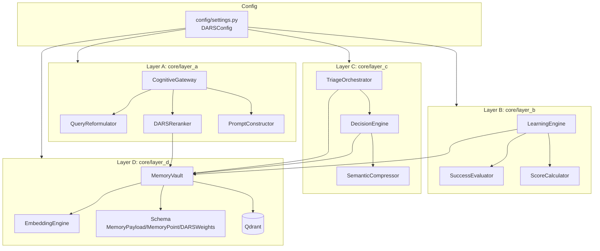
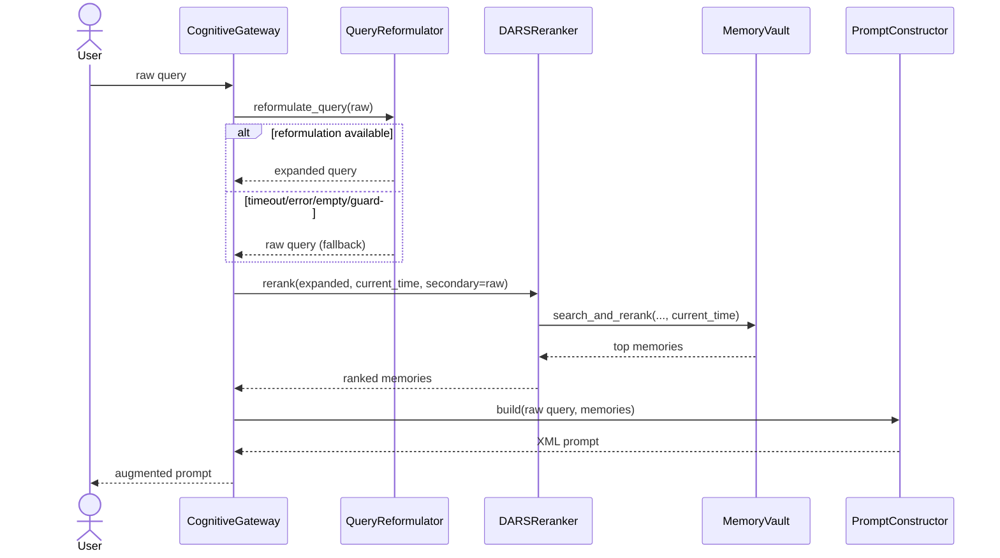
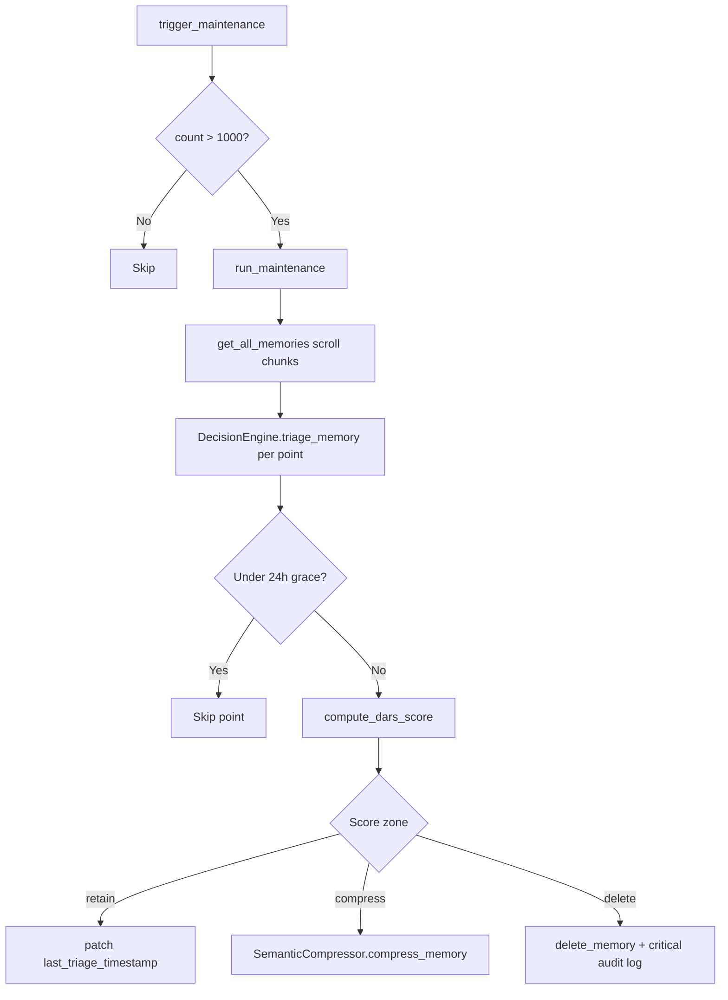
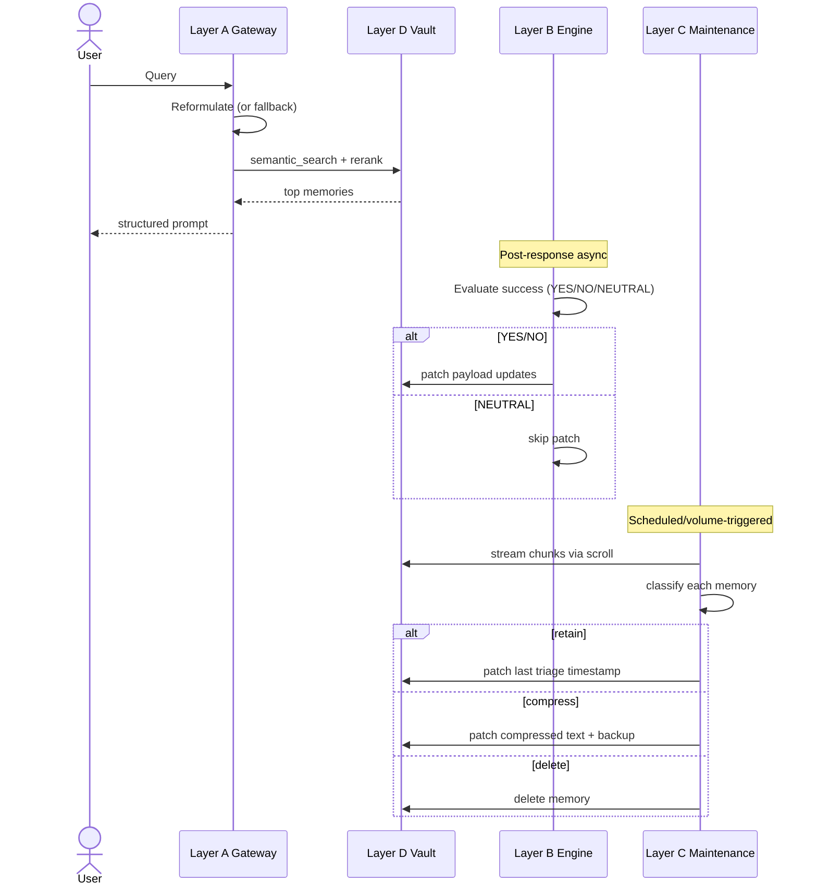

# DARS Mini Project — Complete Architecture Specification

## 1) System Intent and Design Contract

Dynamic Adaptive Retention Scoring (DARS) is a layered memory architecture for AI-agent long-term context. The system is organized around four runtime layers:

- Layer A: Cognitive Gateway (query preparation + retrieval handoff + prompt construction)
- Layer B: Learning Engine (post-response feedback loop + metadata adaptation)
- Layer C: Maintenance Manager (background triage, compression, and deletion policy)
- Layer D: Memory Vault (vector storage, DARS scoring, retrieval, and atomic metadata updates)

The architecture enforces a strict handoff contract:

- Layer A never mutates storage directly; it retrieves and formats.
- Layer B mutates only metadata via Layer D patch/update paths.
- Layer C governs lifecycle actions using score thresholds and policy boundaries.
- Layer D is the single source of truth for persisted vectors and payload state.

---

## 2) Repository Architecture Map

### Files and Responsibilities

- `config/settings.py`: global configuration constants and normalization rules.
- `core/layer_a/reformulator.py`: asynchronous LLM query expansion with fail-open fallback.
- `core/layer_a/reranker.py`: bridge to Layer D reranking.
- `core/layer_a/prompt_constructor.py`: XML-safe prompt assembly.
- `core/layer_a/gateway.py`: async pipeline orchestration.
- `core/layer_b/evaluator.py`: LLM-based binary judgment (`YES`/`NO`, neutralized otherwise).
- `core/layer_b/calculator.py`: deterministic metadata update computation.
- `core/layer_b/engine.py`: async orchestration for patches and new-fact ingestion.
- `core/layer_c/triage.py`: maintenance scheduler and chunked scan runner.
- `core/layer_c/janitor.py`: score-based decision policy executor.
- `core/layer_c/compressor.py`: semantic summarization + compression patching.
- `core/layer_d/embedding.py`: singleton embedding model wrapper.
- `core/layer_d/schema.py`: canonical payload and point dataclasses.
- `core/layer_d/storage.py`: Qdrant lifecycle, CRUD, retrieval, rerank, scoring, classification.

---

## 3) Configuration Architecture (`DARSConfig`)

### External Connectivity

- Gemini:
  - `GEMINI_API_KEY`
  - `GEMINI_PROJECT_NUMBER`
  - `GEMINI_MODEL` (default `gemini-2.5-flash`)
- Qdrant:
  - `QDRANT_URL`
  - `QDRANT_API_KEY`

### Memory and Vector Defaults

- `EMBEDDING_MODEL = all-MiniLM-L6-v2`
- `VECTOR_DIMENSION = 384`
- `COLLECTION_NAME`, `TEST_COLLECTION_NAME`

### DARS Weights

- `WEIGHT_RECENCY = 0.30`
- `WEIGHT_FREQUENCY = 0.20`
- `WEIGHT_UTILITY = 0.30`
- `WEIGHT_PREDICTIVE = 0.20`

`validate_and_normalize()` enforces sum-to-one behavior under epsilon tolerance. Runtime scoring in Layer D uses this vector through `DARSWeights`.

### Policy and Scoring Constants

- `RECENCY_DECAY_LAMBDA = 0.01`
- `FREQUENCY_CAP = 50`
- `DEFAULT_PREDICTIVE_VALUE = 0.5`
- `GOAL_VECTOR = [0.0] * 384`
- `THRESHOLD_RETAIN = 0.7`
- `THRESHOLD_COMPRESS = 0.3`

### Retrieval Defaults

- `DEFAULT_FETCH_K = 10`
- `DEFAULT_TOP_N = 3`
- `RERANK_ALPHA = 0.5`
- `DISTANCE_METRIC = Cosine`

---

## 4) Data Model Architecture (Layer D Schema)

## `MemoryPayload`

Canonical metadata envelope persisted with each vector:

- `text_content: str`
- `success_count: int`
- `failure_count: int`
- `utility: float`
- `frequency: int`
- `recency: float`
- `predictive: float`
- `created_at: float`
- `is_compressed: bool`
- `source: str`
- `tags: list[str]`
- `original_vector: list[float] | None` (serialized only when present)

Methods:

- `to_dict()`: emits persistence-safe dict, drops `original_vector` when `None`.
- `from_dict()`: tolerant deserialization; ignores unknown keys.
- `compute_utility()`: Laplacian-smoothed utility update in-place.

## `MemoryPoint`

Transport structure for retrieval and ranking:

- `point_id`
- `vector`
- `payload`
- `score` (semantic/combined)
- `dars_score`

## `DARSWeights`

Weight vector with `validate()` sum check.

## `RetentionDecision`

Triage output envelope:

- `action`
- `dars_score`
- `point_id`
- `text_preview`

---

## 5) Mathematical Core

### Recency

$$
R = e^{-\lambda \Delta t_{hours}}
$$

where $\Delta t_{hours} = \max(t_{now} - t_{last}, 0)/3600$.

### Frequency

$$
F = \min\left(\frac{\log(1+f)}{\log(1+F_{cap})}, 1.0\right)
$$

### Utility (Laplacian Smoothing)

$$
U = \frac{s+1}{s+f+2}
$$

### Composite DARS Score

$$
S = w_rR + w_fF + w_uU + w_pP
$$

Output clamped to $[0,1]$ in implementation.

### Hybrid Retrieval Score

For candidate $i$:

$$
score_i = \alpha \cdot sim_i + (1-\alpha)\cdot S_i
$$

where `sim_i` is min-max normalized unless similarity variance is very low; in that case similarity is treated as a constant (tie-breaking by DARS).

---

## 6) Layer A Architecture (Cognitive Gateway)

## `QueryReformulator`

- Makes async Gemini REST call with a **narrative retrieval** expansion prompt (temporal anchors, exclusions, entity names; explicitly discourages synonym-only output).
- Guard rails:
  - **empty / whitespace-only input** → return raw query (no LLM call)
  - fallback when no API key
  - fallback on timeout/errors
  - fallback on empty model output
  - **degenerate expansion** heuristic (`_is_degenerate_expansion`) → raw query

Result: robust fail-open behavior preserving user query continuity.

## `DARSReranker`

- Thin adapter over `MemoryVault.search_and_rerank()`.
- Inputs: `query`, `fetch_k`, `top_n`, `alpha`, optional **`current_time`** for DARS recency, optional **`secondary_query`** for dual-pool fusion when `MAB_DUAL_QUERY_RETRIEVAL` is enabled.
- After ranking: optional **chunk N±1** neighbor fetch (via `fetch_points_for_chunk_indices`) when `MAB_EXPAND_NEIGHBOR_CHUNKS` is true.
- Output: top `MemoryPoint` results (expanded neighbors appended, deduped).

## `PromptConstructor`

- XML-aware, escapes critical symbols:
  - `&`, `<`, `>`, `"`
- Prompt sections:
  - `<system_context>`
  - `<memory_stream>` with per-memory attributes (`system_weight`, `last_accessed`)
  - `<current_user_query>`

## `CognitiveGateway`

Pipeline:

1. Reformulate raw query asynchronously.
2. Execute rerank call in executor (prevents event-loop blocking due to sync vector DB calls).
3. Build final structured prompt using raw user query + retrieved memories.

### MemoryAgentBench narrative / EventQA stack (Layer A + D + driver)

These behaviors apply when the MAB driver calls `apply_mab_narrative_profile()` (default unless `--no-narrative`). They are the implementation backing the “64% → ≥90% EM” retrieval plan.

| Requirement | Status | Where |
| --- | --- | --- |
| **Narrative–temporal reformulation** (anchors, exclusions, not synonym-only); empty/whitespace → raw; reject trivial expansions | **Implemented** | `core/layer_a/reformulator.py`: Gemini prompt asks for time/discourse anchors, entities, next-event hooks, obsolete-state exclusions; early return when `raw_query` is empty/whitespace-only; `_is_degenerate_expansion` rejects weak expansions and returns the raw query. |
| **`current_time` at query = end of narrative** (virtual clock when enabled, else wall clock); threaded **gateway → reranker → `search_and_rerank`** | **Implemented** | `benchmarks/memory_agent_bench/runner.py` sets `narrative_query_clock` from virtual chunk timeline or `time.time()`; passes `current_time` into `gateway.process_query_timed` (Path A) and `reranker.rerank` (Path B). `core/layer_a/gateway.py` forwards `current_time` and optional `secondary_query` into `DARSReranker.rerank`. `core/layer_d/storage.py` `search_and_rerank` / DARS scoring use that clock for recency decay. |
| **N±1 neighbor expansion**; wider **`fetch_k` / `top_n`** defaults; **optional dual-query fusion** (reformulated + raw) | **Implemented** | `core/layer_a/reranker.py`: after top-N ranking, expands `chunk:i±1` when `MAB_EXPAND_NEIGHBOR_CHUNKS` is true (default on in config). CLI defaults `fetch_k=25`, `top_n=5`. When `MAB_DUAL_QUERY_RETRIEVAL` is true (narrative profile turns it on), two retrieval pools are merged by best score per point, then truncated. |
| **`superseded` payload + retrieval filter**; **ingest-time tombstone** of similar older chunks (same episode, lower chunk index, sim ≥ τ, not immediate predecessor) | **Implemented** | `core/layer_d/schema.py`: `superseded` on `MemoryPayload`. `core/layer_d/storage.py`: `semantic_search(..., exclude_superseded=True)` and `search_and_rerank` use the filter; `supersede_similar_lower_chunks` called from MAB `runner.py` after each chunk store. Threshold: `MAB_TOMBSTONE_SIM_THRESHOLD` (env / config). |

---

## 7) Layer B Architecture (Learning Engine)

## `SuccessEvaluator`

- Async Gemini call for post-answer judgment.
- Enforces credential validity (`missing` or `dummy_key` -> runtime failure).
- Returns:
  - `YES`/`NO` for strict outputs
  - `NEUTRAL` for non-binary model output or API failure scenarios

## `ScoreCalculator`

Deterministically computes next metadata snapshot:

- increments `success_count` / `failure_count`
- increments `frequency`
- computes `utility` using Laplacian formula
- sets new `recency`

## `LearningEngine`

### `process_feedback_loop()`

- Converts retrieved memories to judge context string.
- Calls evaluator.
- If `NEUTRAL`: no metadata mutation.
- If binary verdict: computes updates and patches each retrieved memory through Layer D.
- Executes blocking patch calls via executor.

### `ingest_new_facts()`

- Embeds fact text.
- Computes predictive alignment from `GOAL_VECTOR` via cosine similarity.
- clamps predictive to $[0,1]$.
- stores memory via Layer D with explicit `predictive_value`.

---

## 8) Layer C Architecture (Maintenance and Lifecycle)

Layer C currently exports only production components:

- `TriageOrchestrator`
- `DecisionEngine`
- `SemanticCompressor`

## `TriageOrchestrator`

- `MAX_MEMORY_THRESHOLD = 1000`
- `trigger_maintenance()`:
  - counts memories
  - starts maintenance only above threshold
- `run_maintenance()`:
  - obtains chunked generator from Layer D (`scroll_yield=True`)
  - processes points in batches
  - dispatches per-point triage tasks using async gather
  - surfaces critical failures (raises after logging)

## `DecisionEngine`

Per-memory policy execution:

1. 24-hour grace period check (`created_at` and `recency`) to avoid premature triage.
2. Compute score through Layer D.
3. Apply decision boundaries with epsilon guard:
   - retain zone (update `last_triage_timestamp`)
   - compress zone (invoke compressor when not yet compressed)
   - delete zone (critical log + permanent removal)

## `SemanticCompressor`

- Requires valid Gemini credential; missing or `dummy_key` is a hard error.
- Prompts model for dense factual summary.
- Patches payload fields:
  - `text_content`
  - `original_text_backup`
  - `is_compressed=True`
- Leaves vector untouched (preserves retrieval geometry).

---

## 9) Layer D Architecture (Memory Vault)

## `EmbeddingEngine`

- Singleton-like model loader for `sentence-transformers`.
- Lazy-loads model on first use.
- API:
  - `dimension`
  - `encode(text)`
  - `encode_batch(texts)`
  - `cosine_similarity(a,b)`

## `MemoryVault` Responsibilities

### Collection Management

- `initialize_collection(recreate=False)`
  - creates collection with configured vector size and metric
  - creates payload indexes (`frequency`, `success_count`, `failure_count`, `utility`)
- `get_collection_info()`
- `delete_collection()`

### Creation

- `store_memory(text, predictive_value, source, tags)`
- `store_memories_batch(memories)`

Both initialize payload with DARS defaults and persisted timestamps.

### Retrieval and Search

- `get_memory(point_id)`
- `get_all_memories(limit, with_vectors, scroll_yield)`
- `semantic_search(query_text, top_k, utility_threshold, score_threshold, exclude_superseded=True)`
- `search_and_rerank(query_text, fetch_k, top_n, alpha, current_time=...)`
- `supersede_similar_lower_chunks(chunk_text, new_chunk_index, sim_threshold)` (MemoryAgentBench ingest tombstones)
- `fetch_points_for_chunk_indices(indices)` (neighbor window for reranker)

### Atomic Metadata Updates

- `patch_payload(point_id, updates)`
- `update_recency(point_id)`
- `increment_frequency(point_id)` with optimistic lock check
- `update_utility(point_id, success)` with optimistic lock check
- `update_on_retrieval(point_id, success)`

### Deletion

- `delete_memory(point_id)`
- `delete_memories_batch(point_ids)`

### Scoring and Classification

- `_compute_recency()`
- `_compute_frequency()`
- `_compute_utility_score()`
- `compute_dars_score()`
- `classify_memory()`
- `triage_all_memories()`
- `count_memories()`

---

## 10) Cross-Layer Handoff Contracts

## A -> D

- Retrieval handoff carries expanded query.
- Prompt handoff uses raw query plus retrieved memory payload.

## B -> D

- Feedback updates must use schema-native keys:
  - `success_count`, `failure_count`, `frequency`, `utility`, `recency`

## C -> D

- Triage uses score/classification APIs from Layer D.
- Compression patches text payload only; vector index remains stable.

## Config -> All Layers

- Runtime behavior (thresholds, weights, defaults, models, endpoints) must remain consistent and centrally defined.

---

## 11) Failure Semantics and Safety Behavior

### Fail-open paths

- Layer A reformulation falls back to raw query when model is unavailable or output is unsafe.

### Fail-loud paths

- Layer B evaluator raises when credentials are invalid (prevents silent “no-op learning”).
- Layer C compressor raises when credentials are invalid (prevents fake synthetic compression).
- Layer C maintenance orchestrator re-raises critical cycle failures.
- Layer D optimistic lock mismatch raises runtime errors to surface concurrent update races.

### Neutralization behavior

- Layer B evaluator returns `NEUTRAL` on non-binary model output or API failure while credentials are valid; engine skips patching for safety.

---

## 12) Concurrency and Execution Model

- Asynchronous orchestration in Layers A/B/C (`async def` workflows).
- Synchronous heavy operations (Qdrant access, selected CPU-bound calls) executed through executor offloading where needed.
- Batch/chunk model in maintenance avoids loading full collection into memory.

---

## 13) Test Architecture and Verification Surface

Test suites validate behavior at multiple levels:

- Unit/component behavior (`test_embedding.py`, `test_schema.py`, `test_scoring.py`, `test_layer_*.py`)
- Integration with storage lifecycle and query/rerank (`test_integration.py`)
- Risk-driven loophole checks (`test_loophole_audit.py`)
- Research-verifier contract checks (`test_verifier_research_audit.py`)
- Accuracy and policy checks (`test_accuracy.py`)

Current validation status at time of writing: **118/118 passing**.

---

## 14) External Dependencies

- `qdrant-client`
- `sentence-transformers`
- `numpy`
- `python-dotenv`
- `aiohttp`
- `pytest`
- `pytest-asyncio`

Runtime model and service dependencies:

- Sentence transformer model (`all-MiniLM-L6-v2`)
- Gemini endpoint for reformulation/evaluation/compression
- Qdrant collection as persistent vector store

---

## 15) Architecture Integrity Guarantees (Current State)

1. Layer C public API exports production orchestrator components only.
2. Fake synthetic compression fallback path is removed.
3. Feedback and maintenance critical failures are surfaced, not silently swallowed.
4. Test isolation around global weight mutation is restored via deterministic cleanup.
5. DARS scoring path remains bounded and schema-consistent across layers.

---

## 16) End-to-End Runtime Lifecycle

This document is the full implementation architecture baseline for the current DARS Mini Project codebase.