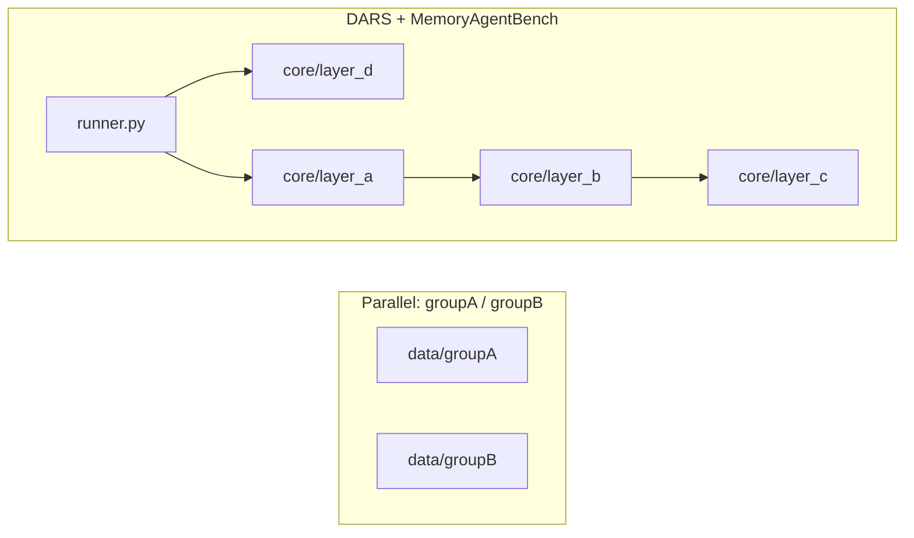

# Figure 0.1: System scope and parallel code paths

## Purpose

Prevent the diagram agent from **merging unrelated pipelines**. This figure separates the **DARS core + MemoryAgentBench (MAB)** evaluation story from **legacy / parallel** PDDL-oriented assets under `data/groupA` and `data/groupB`.

## Audience

Thesis methods section editor; anyone producing a single “system overview” diagram.

## Scope and constraints

- **In scope for MAB figures (1.2–1.9):** `core/`, `benchmarks/memory_agent_bench/`, `third_party/memoryagentbench_eval/`, Qdrant + Gemini + HF embedding usage as wired in the runner.
- **Out of scope for MAB narrative unless explicitly scoped:** `data/groupA/`, `data/groupB/` — treat as **parallel experiments** or course artifacts, not the driver for `store_memory` / `search_and_rerank` in the MAB runner.

## Entities (legend)

| Zone | Meaning |
|------|---------|
| **DARS + MAB** | Primary stack: ingest → Layer D vault → retrieval → Layer A prompt → Gemini → Layer B feedback → Layer C janitor (when scheduled). |
| **Group A / B** | Separate data and scripts; do not label as “the benchmark” without a separate scope box. |

## Visual specification

- **Two disjoint swimlanes or boxes** with a clear “not connected” gap (no arrows between them unless the thesis explicitly integrates them).
- Optional third box: **“External services”** (Qdrant, Gemini API, Hugging Face Hub).

## Mermaid seed

## Do / Don't

- **Do** state in the caption that Group A/B are **out of scope** for the MAB results unless cited.
- **Don't** draw a single pipeline from `groupA` PDDL files into `store_memory` without evidence in code.

## Source files

- `benchmarks/memory_agent_bench/runner.py`
- `data/groupA/`, `data/groupB/` (presence only; no MAB dependency implied)

## Caption draft

*Figure 0.1 — Scope of the MemoryAgentBench evaluation stack versus parallel Group A/B data paths.*
