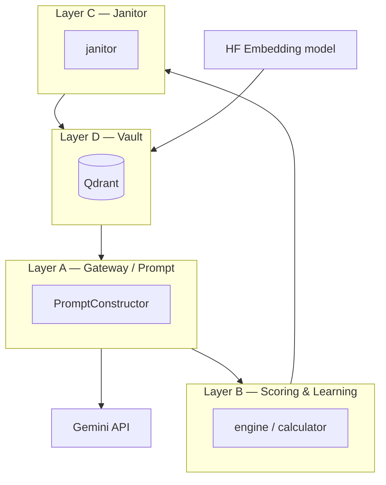

# Figure 1.2: DARS multi-layer architecture

## Purpose

Show the **four conceptual layers** (D, A, B, C), their responsibilities, and how they connect to **Qdrant**, **Gemini**, and the **Hugging Face** embedding model used for vectors.

## Audience

Architecture / design chapter; aligns with `ARCHITECTURE_DIAGRAMS.md` F1–F2.

## Entities and notation

| Layer | Role (implementation anchor) |
|-------|--------------------------------|
| **D** | `core/layer_d/` — Qdrant vault, `MemoryPayload`, `search_and_rerank`, `classify_memory` thresholds. |
| **A** | `core/layer_a/` — gateway-style prompt construction (`prompt_constructor.py`), Path A XML shaping. |
| **B** | `core/layer_b/` — DARS scoring utilities, reformulator/reranker where used, Laplace-style utility updates, `ingest_new_facts` path. |
| **C** | `core/layer_c/janitor.py` — maintenance cycle, grace period, priority tag branch, compress/delete. |

**External:** Qdrant server/collection; Gemini API (via transport); HF model id for embeddings (see runner manifest).

## Visual specification

- **Stacked or left-to-right** layers D → A → B → C with bidirectional or downward feedback arrows as in `ARCHITECTURE_DIAGRAMS.md`.
- **Sidecars:** Qdrant cylinder icon; cloud for Gemini; small HF logo or “HF Hub” for embedder.
- Show **data at rest** in Qdrant under D; **inference** through Gemini touching A (and reader in MAB).

## Mermaid seed (expand in final figure)

## Do / Don't

- **Do** keep layer boundaries consistent with `Architecture.md`.
- **Don't** imply a separate “chat UI” unless you add it as an explicit future box.

## Source files

- `Architecture.md` §4–6
- `ARCHITECTURE_DIAGRAMS.md` (F1, F2)
- `core/layer_d/storage.py`, `core/layer_a/prompt_constructor.py`, `core/layer_b/engine.py`, `core/layer_c/janitor.py`

## Caption draft

*Figure 1.2 — DARS four-layer architecture with Qdrant persistence, Hugging Face embeddings, and Gemini inference.*
