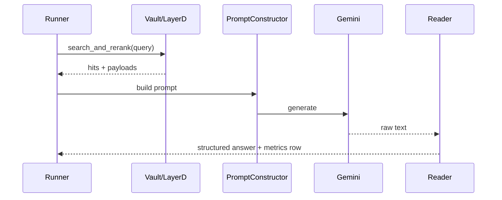

# Figure 1.3: Multi-turn interaction sequence

## Purpose

Two **sequence diagrams**: **Path A** (gateway / XML-style contract) and **Path B** (MAB bullet contract). “Multi-turn” here means **multiple QA rows per context episode** in the benchmark (and optional query reformulation per turn where enabled), not a separate end-user chat application.

## Audience

Methods: inference and evaluation protocol.

## Lifelines (shared vocabulary)

| Lifeline | Code anchor |
|----------|-------------|
| **Runner** | `benchmarks/memory_agent_bench/runner.py` |
| **Reader** | `benchmarks/memory_agent_bench/reader.py` — `answer_with_gateway_xml` vs `answer_with_memories_bullets` |
| **Vault / Layer D** | `search_and_rerank`, `retrieve_neighbors` branches as used |
| **Reformulator** | Path B branch when dual-query / reformulation enabled |
| **Reranker** | Layer B reranking step when present in call chain |
| **PromptConstructor** | `core/layer_a/prompt_constructor.py` — respects `MAX_PROMPT_CHARS` |
| **Gemini API** | Via `core/gemini_transport.py` |

## Path A (high-level message order)

1. Runner loads QA for episode → builds query.
2. Runner calls vault retrieval (vector + DARS hybrid / RRF per config).
3. Runner constructs prompt (Path A) → **Gemini**.
4. Reader parses **XML + `Answer:`** style output (see `answer_with_gateway_xml` implementation).

## Path B (high-level message order)

1. Runner may invoke **reformulator** (if configured) before or alongside retrieval.
2. Retrieval (possibly **dual-query** / neighbor expansion when that branch is active).
3. Prompt construction → **Gemini** with memories embedded per Path B template.
4. Reader **`answer_with_memories_bullets`** — enforces bullet usage; may apply **best concise guess** behavior when extraction fails (read source for exact strings).

## Ingestion sub-pipeline (footnote or small inset)

For **how memories enter the vault** during MAB:

`loader.py` → `qa_builder.py` → `chunking.py` → per-chunk **`store_memory`** with ephemeral collection naming and tags such as `chunk:{i}`, `mab:split:...` (see `runner.py`).

## Visual specification

- **Two panels** side by side: “Path A” and “Path B”.
- Use **alt fragments** for optional reformulation / neighbor retrieval.
- Annotate **truncation** at PromptConstructor when context exceeds `MAX_PROMPT_CHARS` (constant in `prompt_constructor.py`; verify current value in repo).

### Illustration checklist (MemoryAgentBench `runner.py` truth)

Use this so the figure stays **accurate** and you can still keep the **layout** clean by moving detail to the caption or a supplement.

| Topic | Code truth | Common diagram mistake |
|--------|--------------|-------------------------|
| **Path A orchestration** | `runner.py` calls only `CognitiveGateway.process_query_timed` for Path A. Inside the gateway: **Reformulator → `DARSReranker.rerank` (which calls `MemoryVault.search_and_rerank`) → `PromptConstructor.build`**. | Showing **Runner → Vault** as if the runner called Qdrant directly, or a **separate “optional reranker”** disconnected from the gateway bundle. Prefer one **Gateway** swimlane or show **Reranker** nested under gateway. |
| **Who calls Gemini (Path A)** | **`GeminiBenchmarkReader.answer_with_gateway_xml`** builds the REST prompt and calls Gemini (`reader.py`). | Arrow **PromptConstructor → Gemini**. Should be **Reader → Gemini** (prompt is already built XML + system line from reader). |
| **Path B orchestration** | Runner calls **`DARSReranker.rerank`** then **`_memories_to_bullets`**, then **`Reader.answer_with_memories_bullets`** — **no** `CognitiveGateway` / **no** `PromptConstructor`. | Lifeline **PromptConstructor** or message **`build_bullet_prompt`** — not in this path; name the step **“format bullets (runner)”** or similar. |
| **Reformulator on Path B** | Default MAB Path B branch in `runner.py` does **not** call `QueryReformulator`. Reformulation timing keys exist for Path A (`gateway_timings`). | Optional **Reformulator** on Path B should be labeled **“not used by default MAB runner”** or omitted unless you document another entry point. |
| **Neighbor / dual-query** | No `retrieve_neighbors` / dual-query in `benchmarks/memory_agent_bench/runner.py`. | Same: **omit** or mark **“not in current MAB harness”** unless you wire it elsewhere. |
| **XML build API** | `PromptConstructor.build(query, memories)` (`prompt_constructor.py`). | Rename any **`build_gateway_prompt`** placeholder to **`PromptConstructor.build`**. |
| **Output contract (Path A)** | Reader instructs model to start with **`Answer:`**; eval uses `parse_output` / metrics pipeline. Input prompt uses **`<memory_stream>`**, **`<current_user_query>`**, etc. | Requiring **`<reasoning>` / `<evidence>`** blocks is **not** enforced by `answer_with_gateway_xml`; only cite them if you measured them as convention, not as code contract. |
| **Path B reader** | System string: bullets-only + **`Answer:`** + “best concise guess” if missing (`reader.py`). | Keep that line in a **small** callout, not repeated on every arrow. |

## Mermaid seed (simplified; UML tool may be clearer)

## Do / Don't

- **Do** label Path A vs Path B output contracts explicitly (XML vs bullets).
- **Don't** claim a separate “chat session store” unless you add it as non-repo scope.

## Source files

- `benchmarks/memory_agent_bench/runner.py`
- `benchmarks/memory_agent_bench/reader.py`
- `benchmarks/memory_agent_bench/loader.py`, `qa_builder.py`, `chunking.py`
- `core/layer_a/prompt_constructor.py`
- `core/layer_d/storage.py`

## Caption draft

*Figure 1.3 — Sequence of MemoryAgentBench inference for Path A (gateway XML) versus Path B (bullet contract), including ingestion into the vault.*

### LaTeX build specification

- **TeX:** `reports_latex/diagrams/tex/fig_1_3.tex` — stacked flow panels (Path A: full gateway; Path B: rerank-only per `runner.py`).
- **PDF:** `reports_latex/diagrams/pdf/fig_1_3.pdf` after `.\build.ps1` from `reports_latex/diagrams` (needs `latexmk` or `pdflatex` on `PATH`).
- **Style:** `tex/dars-fig-preamble.tex` — accent `#2E5AAC`, neutral `#555555`, fills `#E8EBF0` / `#F4F5F7`; thesis width target `0.85\linewidth`.
