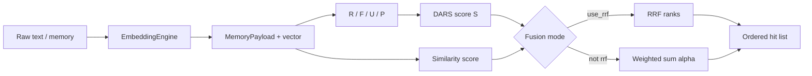

# Figure 1.4: DARS scoring variable dataflow

## Purpose

A **DFD-style** figure from **raw text / memory fields** through **R, F, U, P** components to the scalar **DARS score S**, then into **retrieval ranking** together with **vector similarity**. Include the **RRF vs weighted-sum** branch for final ordering.

## Audience

Methods / formal model section; cross-reference `Architecture.md` §5–6.

## Entities and notation

- **Inputs:** `MemoryPayload` fields (relevance, frequency, usage, provenance-related signals — use exact field names from code where plotted).
- **Intermediate:** component scores **R, F, U, P** (or their normalized forms as implemented).
- **Output:** **S** = DARS scalar (`compute_dars_score` path in codebase).
- **Retrieval fusion:**
  - **Default:** RRF over two ranked lists (similarity rank vs DARS rank), parameters `use_rrf=True`, `rrf_k=60` in `search_and_rerank` (see `core/layer_d/storage.py` docstring and implementation).
  - **Fallback:** `use_rrf=False` → hybrid **α·sim_norm + (1−α)·dars** (wording may vary; verify `alpha` in code).

## Layer B learning branch (small sub-flow or callout)

**`ingest_new_facts`** / **GOAL_VECTOR** / predictive alignment — show as a **branch feeding back** into new `store_memory` writes so predictive **P** is computed in storage (cosine vs goal vector, with `DEFAULT_PREDICTIVE_VALUE` fail-safe per `DARSConfig`). Implemented in `LearningEngine.ingest_new_facts` → `MemoryVault.store_memory` (`core/layer_b/engine.py`).

## Equations

Copy the **authoritative** equations and weight definitions from `Architecture.md` §5–6 into the figure legend; do not paraphrase coefficients if the thesis cites a specific table.

## Visual specification

- Left-to-right: **Ingest** (raw + embed) → **MemoryPayload** → **R,F,U,P** → **S** → **Rank fusion** → **Top-k to Layer A**.
- Use a **diamond** or **switch** node: `use_rrf ? RRF : weighted_sum`.
- Optional recency: if `current_time` is passed into ranking, show as a dashed input to fusion (see `search_and_rerank` signature).

## Mermaid seed

## Do / Don't

- **Do** cite RRF and `rrf_k` when drawing the default path.
- **Don't** label undocumented signals as “episodic vs procedural” without mapping to implemented fields.

## Source files

- `Architecture.md` §4–6, §8 (thresholds for retention vs retrieval)
- `core/layer_d/storage.py` — `search_and_rerank`, `classify_memory`
- `core/layer_b/engine.py` — `LearningEngine.ingest_new_facts`
- `config/settings.py` — `DEFAULT_PREDICTIVE_VALUE`, DARS weights

## Caption draft

*Figure 1.4 — Dataflow from embedded memory fields through DARS components to score S and hybrid retrieval fusion (RRF or weighted similarity–DARS combination).*

### LaTeX build specification

- **TeX:** `reports_latex/diagrams/tex/fig_1_4.tex` — left-to-right DFD with **RRF vs α-blend** diamond (`use_rrf`; `rrf_k=60` default in `search_and_rerank`).
- **PDF:** `reports_latex/diagrams/pdf/fig_1_4.pdf`; build via `reports_latex/diagrams/build.ps1`.
- **Style:** `tex/dars-fig-preamble.tex`; dashed branch for `ingest_new_facts` → `store_memory`.
