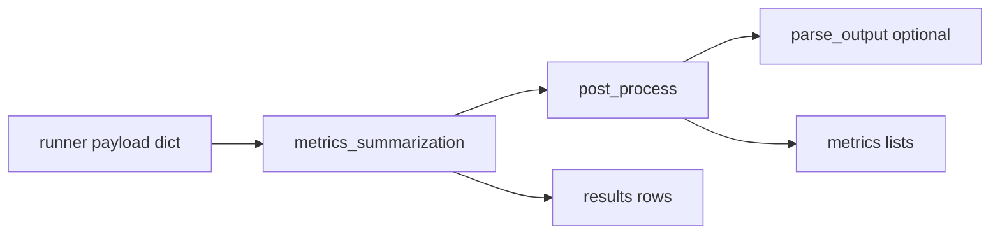

# Figure 1.4b: Benchmark scoring contract

## Purpose

Show how **one QA row** becomes **scalar metrics** and a **`results.json` record**, so results figures (1.7, 1.8) do not invent evaluation logic.

## Audience

Results / reproducibility section; appendix for eval protocol.

## Pipeline (authoritative order)

1. **Runner** builds `payload` dict per QA: model `output`, token lengths, timing, `token_savings_ratio`, DARS diagnostics, `path_mode`, etc. (`benchmarks/memory_agent_bench/runner.py`).
2. **`metrics_summarization`** (`third_party/memoryagentbench_eval/eval_other_utils.py`) is called with `(payload, query, answer, dataset_config, metrics, results, ...)`.
3. Inside `metrics_summarization`:
   - **`post_process(output, answer, dataset_config)`** routes on **`dataset_config['sub_dataset']`** (`eval_other_utils.py`): e.g. EventQA, RULER, ICL, InfBench/LongMemEval, Recsys, or the **`else`** branch → **`default_post_process`**.
   - **`default_post_process`** runs `calculate_metrics` on the **raw** `output["output"]`, then optional **`parse_output`**; if parse succeeds, it takes the **element-wise `max`** between raw and parsed per metric key.
   - **Dataset-specific branches** (e.g. `_process_eventqa_dataset`) **do not** necessarily use that max-merge pattern; they add fields like **`eventqa_recall`** — read the branch used by your `sub_dataset` before drawing a single “parse vs raw max” diamond for all runs.
4. **Augment** `output` with `parsed_output` and calculated metrics; **append** running lists in `metrics`; **append** full **`result_record`** to `results` (includes `answer`, `query`, ids).

## Metrics keys to show in legend

From archived `metrics_summary.json` / per-row `results.json` (non-exhaustive):

| Key | Role |
|-----|------|
| `exact_match` | Boolean per sample (aggregated mean in summary). |
| `f1` | Token F1 from `f1_score` helper. |
| `substring_exact_match` | Relaxed exact check after normalization. |
| `rougeL_f1`, `rougeL_recall`, `rougeLsum_*` | ROUGE-L family. |
| `eventqa_recall` | Dataset-specific branch inside metric calculation. |
| `input_len`, `output_len` | Token counts (`count_tokens`). |
| `memory_construction_time`, `query_time_len` | Timing fields. |

Always read **`dataset_config`** influence: some metrics appear only for certain sources/splits.

## Visual specification

- Swimlane: **Runner** → **`metrics_summarization`** → **`post_process` / `parse_output`** → **running `metrics` + `results` append**.
- Diamond: “`parsed_output` non-null?” with **max-merge** on the YES branch.

## Mermaid seed

## Do / Don't

- **Do** state that parsed vs raw uses **max** per metric name when both exist.
- **Don't** label a single metric as “the only accuracy” without naming the split and key.

## Source files

- `benchmarks/memory_agent_bench/runner.py` (payload assembly + `metrics_summarization` call)
- `third_party/memoryagentbench_eval/eval_other_utils.py` — `metrics_summarization`, `post_process`, `parse_output`, `calculate_metrics`, `f1_score`, `drqa_exact_match_score`

## Caption draft

*Figure 1.4b — Scoring contract from runner payload through vendored `metrics_summarization` into per-sample results and aggregate summaries.*
