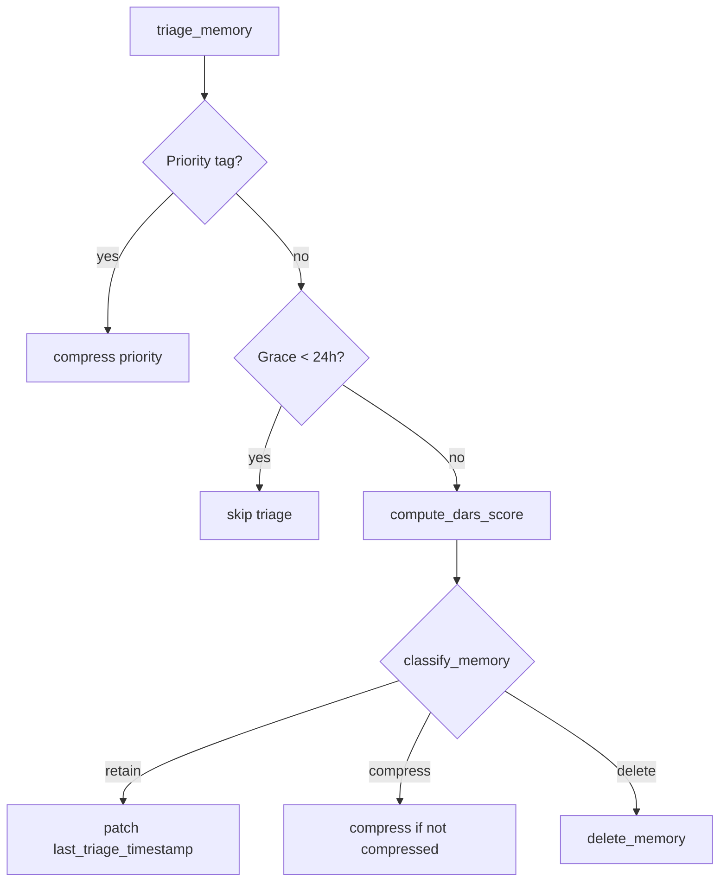

# Figure 1.5: Janitor selective retention

## Purpose

Map **research language** (“selective forgetting / retention”) to **implemented mechanisms**: **24-hour grace**, **priority tag** `system:high_priority_distillation`, **`compute_dars_score`**, and **`classify_memory`** thresholds.

## Audience

Methods: Layer C maintenance policy.

## Research ↔ implementation mapping

| Thesis-style term | Implementation |
|-------------------|------------------|
| “Episodic vs procedural” (if used) | **Not literal in code.** Prefer: **grace window** (young memories skipped), **priority distillation** tag forcing compress, otherwise **score bands** from DARS S. |
| “Forgetting” | **`delete_memory`** when `classify_memory` returns `"delete"`. |
| “Consolidation / compression” | **`SemanticCompressor.compress_memory`** on compress path. |

## Thresholds (must match `Architecture.md` §9 and `MemoryVault.classify_memory`)

Configured in `config/settings.py` as `DARSConfig.THRESHOLD_RETAIN` and `THRESHOLD_COMPRESS`:

- **S > `THRESHOLD_RETAIN` (0.7)** → `"retain"` (update `last_triage_timestamp` only).
- **`THRESHOLD_COMPRESS` (0.3) < S ≤ 0.7** → `"compress"` (unless already compressed).
- **S ≤ 0.3** → `"delete"` (logged at critical level in janitor).

`MemoryVault.classify_memory` in `core/layer_d/storage.py` implements the same bands.

## Decision flow (`DecisionEngine.triage_memory`)

1. Read `tags` from payload; **`is_priority`** iff `system:high_priority_distillation` ∈ tags.
2. **Grace:** If **not** priority **and** `(now - created_at < 86400)` **or** `(now - recency < 86400)` → **return** (no triage).
3. **Priority branch:** If priority → **compress** immediately (override normal score path).
4. Else: `score = vault.compute_dars_score(...)`, `action = vault.classify_memory(score)` → retain / compress / delete as above.

## Visual specification

- Top diamond: **Priority tag?**
- Second diamond: **Under 24h grace?** (only on non-priority path).
- Third: **Score bands** with numeric thresholds on edges.
- Use **red/destructive** styling only for delete branch (matches critical audit log intent).

## Mermaid seed

## Do / Don't

- **Do** print **86400** seconds or “24h” explicitly on the grace decision.
- **Don't** invent “episodic goal” nodes without labeling them as **interpretive**, not code literals.

## Source files

- `core/layer_c/janitor.py` — `DecisionEngine.triage_memory`
- `core/layer_d/storage.py` — `compute_dars_score`, `classify_memory`, `patch_payload`, `delete_memory`
- `config/settings.py` — `THRESHOLD_RETAIN`, `THRESHOLD_COMPRESS`

## Caption draft

*Figure 1.5 — Layer C janitor: 24-hour grace, high-priority distillation override, and DARS score bands for retain, compress, and delete.*

### LaTeX build specification

- **TeX:** `reports_latex/diagrams/tex/fig_1_5.tex` — decision tree aligned with `DecisionEngine.triage_memory` (thresholds 0.7 / 0.3 from `DARSConfig`).
- **PDF:** `reports_latex/diagrams/pdf/fig_1_5.pdf`; build via `reports_latex/diagrams/build.ps1`.
