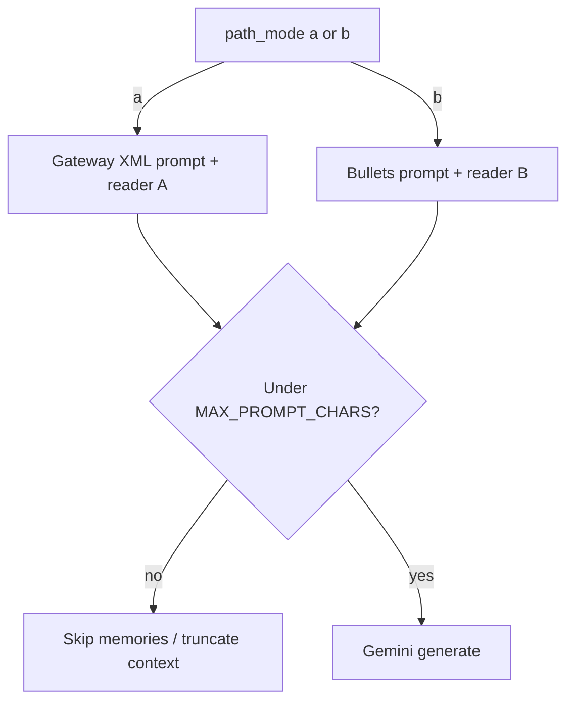

# Figure 1.6: Retrieval path decisions

## Purpose

Replace any informal “triple.complete strict vs relaxed” story with **paths and contracts that exist in this repository**: **Path A vs Path B**, optional **reformulation fail-open**, **prompt budget truncation**, and **reader extraction** behavior.

## Audience

Methods / ablation explanation; pairs with figure 1.3.

## Path mode (`--path`)

From `benchmarks/memory_agent_bench/__main__.py`:

- **`a`** — “full gateway XML reader” (`answer_with_gateway_xml`).
- **`b`** — “rerank bullets” default (`answer_with_memories_bullets`).

## Key decision nodes

1. **CLI / manifest `path_mode`** → selects reader branch and prompt template family.
2. **Reformulator** (`docs/implementation_guide.md` notes **fail-open** to raw query when keys missing or errors) — show as dashed “optional / may noop”.
3. **Retrieval:** `search_and_rerank` with **RRF** vs **weighted sum** (`use_rrf`, `rrf_k`, `alpha` in `core/layer_d/storage.py`); optional neighbor / dual-query branches **only if** your thesis run enables them — verify `runner.py` for the exact flags you used.
4. **Prompt budget:** `PromptConstructor` uses **`MAX_PROMPT_CHARS = 20000`** (`core/layer_a/prompt_constructor.py`); memories may be **skipped** when adding would exceed budget (log: `dars_gateway_context_truncated_total`).
5. **Reader Path B:** `answer_with_memories_bullets` enforces bullet-only answers; may fall back to a **best concise guess** when structured extraction fails — quote the implementation, do not paraphrase as “strict unknown.”
6. **Reader Path A:** XML + `Answer:` style parsing — align lifeline with `reader.py` implementation.

## Visual specification

- Single flowchart with a **bold split** early: Path A vs Path B.
- Use **footnotes** for constants (`MAX_PROMPT_CHARS`, `rrf_k`) with “verify in repo” for version drift.

## Mermaid seed

## Do / Don't

- **Do** cite `MAX_PROMPT_CHARS` from `prompt_constructor.py` (currently **20000**).
- **Don't** reference `triple.complete` as a code symbol; mark it **out of scope** if the thesis still mentions it.

## Source files

- `benchmarks/memory_agent_bench/__main__.py` — `--path`
- `benchmarks/memory_agent_bench/reader.py`
- `benchmarks/memory_agent_bench/runner.py`
- `core/layer_a/prompt_constructor.py`
- `core/layer_d/storage.py` — `search_and_rerank`
- `docs/implementation_guide.md` — reformulator behavior notes

## Caption draft

*Figure 1.6 — Retrieval and decoding decisions: Path A versus Path B, optional reformulator fail-open, prompt truncation, and reader contracts.*

### LaTeX build specification

- **TeX:** `reports_latex/diagrams/tex/fig_1_6.tex` — Path A/B split, `MAX_PROMPT_CHARS=20000`, footnote on default **RRF** retrieval fusion.
- **PDF:** `reports_latex/diagrams/pdf/fig_1_6.pdf`; build via `reports_latex/diagrams/build.ps1`.
