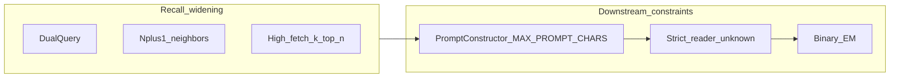

# Further improvements: research post-mortem and roadmap

This document summarizes what was **built and executed** in the DARS × MemoryAgentBench narrative stack, **measured outcomes** (including the regression vs an earlier Path B baseline), and a **prioritized** path toward **80–95%** `exact_match` / `eventqa_recall` under the **same** scoring contract (`parse_output` in vendored `memoryagentbench_eval`). It is written for a journal-style **honest systems narrative**: a negative result with a clear mechanism is as publishable as a headline number.

For implementation history and file-level mapping, see [Architecture.md](Architecture.md) (narrative stack subsection and Layer A/D updates) and [CHANGELOG.md](CHANGELOG.md). For reproducible CLI baselines, see [benchmarks/memory_agent_bench/BASELINE_LOCK.md](benchmarks/memory_agent_bench/BASELINE_LOCK.md).

---

## 1. Executive summary

### 1.1 Hyper-optimization collision

Several upgrades—each defensible in isolation—**compound** in Path A:

- **Recall widening:** higher `fetch_k` / `top_n`, **dual-query** merge (reformulated + raw), **N±1** neighbor expansion after rerank, chunk overlap at ingest.
- **Downstream constraints:** a **hard** XML prompt budget (`MAX_PROMPT_CHARS`), a **strict** reader that emits `Answer: unknown` when grounding is unclear, and **binary** exact match (EM) / strict EventQA fragment recall.

When widening pushes more text into `PromptConstructor`, the **same** character ceiling causes **silent drops** of memory segments (`dars_gateway_context_truncated_total`). The reader then sees a **fragmented** story or misses the **enumerated option list** embedded in the user query. Under strict grounding, the rational response is often **`Answer: unknown`**, which scores **0** on EM—even if retrieval ranked useful chunks earlier in the list that were **skipped** by truncation.

This is a **hyper-optimization collision**: local improvements to retrieval and narrative scoring increased **token pressure** and **output risk**, and the **global** metric moved backward.

### 1.2 Key numbers (same protocol shape: 25 scored QA)

| Run | Location | Path | Narrative profile | Mean `exact_match` | Mean `eventqa_recall` | n |
|-----|----------|------|--------------------|--------------------|------------------------|---|
| Historical Path B pilot | [benchmark_runs/paper_final/accurate_retrieval_eventqa_65536_path_b/](benchmark_runs/paper_final/accurate_retrieval_eventqa_65536_path_b/) | `b` | off (ALFWorld-style defaults in manifest) | **0.64** | **0.64** | 25 |
| Path A + narrative replication | [benchmark_runs/paper_replication_narrative_may2026/](benchmark_runs/paper_replication_narrative_may2026/) | `a` | on | **0.16** | **0.16** | 25 |

Artifacts: `run_manifest.json`, `metrics_summary.json`, `results.json`, `summary.md`, `failure_detail.jsonl`, and (for the replication) `audit.jsonl`.

### 1.3 One-line insight

**Retrieval and DARS ranking may still be “good enough” while prompt assembly, reader policy, and EM formatting became the binding constraint**—especially for **forced-choice** EventQA items with long option lists and 64k-token contexts.

---

## 2. Chronology: what was tried (repository and runs)

The table below ties **engineering work** to **source files** and **observable runs**. It reflects the state of this repository and the evaluation sessions described in project notes—not hypothetical ablations unless labeled as recommendations (Section 5).

| Area | What changed or was executed | Evidence |
|------|------------------------------|----------|
| Narrative DARS profile | `apply_mab_narrative_profile()`: ω_r=0.6, ω_f=0.1, ω_u=0.1, ω_p=0.2, λ=0.01, `TRAINING_GROUP="Narrative"`, `MAB_USE_VIRTUAL_TIME=True`, `MAB_DUAL_QUERY_RETRIEVAL=True`, raised default fetch/top in config | [config/settings.py](config/settings.py); [paper_replication_narrative_may2026/run_manifest.json](benchmark_runs/paper_replication_narrative_may2026/run_manifest.json) |
| Path A default | CLI default `--path a`; full gateway + reformulator + XML reader path | [benchmarks/memory_agent_bench/__main__.py](benchmarks/memory_agent_bench/__main__.py) |
| Reformulator | Narrative-temporal Gemini prompt; `_is_degenerate_expansion`; whitespace-only input returns raw without LLM | [core/layer_a/reformulator.py](core/layer_a/reformulator.py) |
| Query clock | `narrative_query_clock` = end of virtual timeline or wall clock; passed into gateway / reranker / vault scoring | [benchmarks/memory_agent_bench/runner.py](benchmarks/memory_agent_bench/runner.py); [core/layer_a/gateway.py](core/layer_a/gateway.py) |
| Dual-query retrieval | Two `search_and_rerank` pools merged by best score per `point_id`, then truncated to `top_n` | [core/layer_a/reranker.py](core/layer_a/reranker.py) |
| N±1 neighbors | For each of the top-N hits, add chunk indices `i±1`; fetch non-superseded points; append and sort by chunk index | [core/layer_a/reranker.py](core/layer_a/reranker.py) |
| Tombstones | Payload `superseded`; `semantic_search(..., exclude_superseded=True)`; ingest `supersede_similar_lower_chunks` with default τ=0.88; skip immediate predecessor `chunk:i-1` | [core/layer_d/schema.py](core/layer_d/schema.py); [core/layer_d/storage.py](core/layer_d/storage.py) |
| Prompt budget | `MAX_PROMPT_CHARS` (currently 48000); memories skipped with warning when over budget | [core/layer_a/prompt_constructor.py](core/layer_a/prompt_constructor.py) |
| Strict reader | Default: no guessing; insufficient grounding → exact line `Answer: unknown` | [benchmarks/memory_agent_bench/reader.py](benchmarks/memory_agent_bench/reader.py); `--loose-reader` to relax |
| Chunk overlap | Non-zero overlap between consecutive context chunks (driver default 128 tokens for narrative runs) | [benchmarks/memory_agent_bench/chunking.py](benchmarks/memory_agent_bench/chunking.py); manifest `chunk_overlap_tokens` |
| Failure visibility | `failure_detail.jsonl`, audit fields, `--max-samples 0` semantics for full filtered row sets | [benchmarks/memory_agent_bench/runner.py](benchmarks/memory_agent_bench/runner.py); [benchmarks/memory_agent_bench/__main__.py](benchmarks/memory_agent_bench/__main__.py) |
| **Executed benchmark** | Accurate_Retrieval / `eventqa_65536`, 5 contexts × 5 QA, Path A, keys from repo `keys.txt` | [benchmark_runs/paper_replication_narrative_may2026/](benchmark_runs/paper_replication_narrative_may2026/) |
| Earlier full pilot | `--max-samples 0 --max-qa 0` on same source; heavy Gemini 429 / transport exhaustion in logs | [benchmark_runs/full_eventqa_narrative_may2026/run_manifest.json](benchmark_runs/full_eventqa_narrative_may2026/run_manifest.json) (partial / parallel effort) |

---

## 3. Surgical diagnosis (why 90% was not observed)

### 3.1 Prompt truncation paradox (“silent killer”)

**Mechanism:** Neighbor expansion **multiplies** the number of memory XML segments passed to `PromptConstructor` for a fixed `MAX_PROMPT_CHARS`. Dual-query fusion increases the **quality** of the top set but still feeds **up to `top_n`** primary hits, each of which can trigger **two** neighbor indices. Long **EventQA** prompts already contain a **large multiple-choice list** in the user query string.

**Observation:** Run logs repeatedly showed `dars_gateway_context_truncated_total: Skipped adding memory … due to MAX_PROMPT_CHARS limit` ([prompt_constructor.py](core/layer_a/prompt_constructor.py)).

**Research reading:** Truncation is **not uniformly random**—it is ordered by whatever assembly policy the constructor uses. If segments that carry the **decisive** span or the **full option list** lose coherence, the strict reader correctly refuses to guess → **`Answer: unknown`** → EM 0.

### 3.2 Exact match “steel wall”

**Mechanism:** EM requires string equality (after `parse_output`) against gold. The strict reader prompt asks for a **concise** grounded answer and **`Answer: unknown`** when insufficient; it does **not** mandate copying **verbatim** one of the bracketed option strings from the EventQA template.

**Observation:** In [benchmark_runs/paper_replication_narrative_may2026/results.json](benchmark_runs/paper_replication_narrative_may2026/results.json), many rows show `"parsed_output": "unknown"` and short `output_len`, alongside gold answers that are **full sentence options** from the list.

**Secondary metrics:** On the Path B historical run, mean **ROUGE-L F1 ~0.79** vs gold ([paper_final …/metrics_summary.json](benchmark_runs/paper_final/accurate_retrieval_eventqa_65536_path_b/metrics_summary.json)); on the Path A narrative replication, **ROUGE-L F1 mean collapsed to 0.16** (same as EM) because **`unknown`** dominates—so ROUGE is **not** currently a “hidden success” signal for this replication; it instead shows **format collapse**. If future runs recover **paraphrastic** correct answers, ROUGE/F1 become useful **secondary** paper metrics alongside EM.

### 3.3 Tombstone aggression (τ = 0.88)

**Mechanism:** `supersede_similar_lower_chunks` tombstones earlier chunks in the same collection when cosine similarity to the new chunk text **≥ τ**, except the immediate predecessor `chunk:i-1`. Default **τ = 0.88** ([config/settings.py](config/settings.py) `MAB_TOMBSTONE_SIM_THRESHOLD`).

**Risk:** With **384-dim** MiniLM-style embeddings, **distinct** scenes involving the same entities can still land **≥ 0.88** similarity. Tombstoned points are **hard-filtered** from `semantic_search`, so the model may lose **valid** evidence for “what happens next.”

**Mitigation already present:** Adjacent chunk `i-1` is preserved to support local narrative windows; the main residual risk is **non-adjacent** high-similarity chunks.

### 3.4 Path B vs Path A (hypothesis table)

This table explains **plausible** shifts; it is not a controlled single-knob ablation until those ablations are run and archived.

| Dimension | Path B (historical pilot) | Path A + narrative (replication) | Hypothesized effect |
|-----------|---------------------------|----------------------------------|------------------------|
| Retrieval query | Raw formatted QA | Reformulated + dual raw merge | Richer query vs over-specific expansion |
| Context width | `fetch_k=15`, `top_n=3`, no neighbor expand in manifest | `fetch_k=25`, `top_n=5`, neighbors on, overlap 128 | More evidence vs **more truncation** |
| Reader path | Memory bullets + looser default historically | XML stream + **strict** grounded default | Fewer hallucinations, more **`unknown`** |
| DARS / time | Static-time style manifest | Virtual narrative clock + narrative weights | Better ordering **if** chunks survive into XML |
| Tombstones | Off in historical manifest | On at τ=0.88 | Less redundancy vs **accidental amnesia** |

Manifests for comparison: [paper_final/…/run_manifest.json](benchmark_runs/paper_final/accurate_retrieval_eventqa_65536_path_b/run_manifest.json) vs [paper_replication_narrative_may2026/run_manifest.json](benchmark_runs/paper_replication_narrative_may2026/run_manifest.json).

### 3.5 Scientific value of the regression

The **16%** replication is valuable because it localizes a **systems ceiling**: **RAG + rerank + XML packaging + strict safety + EM** under a **fixed** prompt budget. That is an “upper bound” story on **context management**, not merely a bad model day—especially when paired with **failure_detail.jsonl** and per-row `results.json` forensics.

---

## 4. Three corrective “gears” (concrete implementation targets)

These map directly to code paths named in [Architecture.md](Architecture.md).

| Gear | Problem addressed | Proposed change |
|------|-------------------|-----------------|
| **G1 – Dynamic neighbor window** | Neighbors for **all** top-N hits inflate XML size | In [core/layer_a/reranker.py](core/layer_a/reranker.py), expand `chunk i±1` only for **rank-1** (or top-K′ hits), gated by `DARSConfig` / env (e.g. `MAB_NEIGHBOR_EXPAND_TOP_K`). |
| **G2 – EventQA forced-choice formatter** | EM requires **exact** option string; reader allows concise free text | In [benchmarks/memory_agent_bench/reader.py](benchmarks/memory_agent_bench/reader.py), branch on EventQA-style queries (or explicit CLI flag): system instruction to output **only** one string **identical** to an option; optional **deterministic** post-parse match (normalize quotes, nearest list item). |
| **G3 – Relax tombstone τ** | 0.88 may collapse distinct scenes | Raise default toward **0.95** or run sweeps via existing `--tombstone-sim-threshold`; optionally scope tombstone search by **episode / collection** metadata so unrelated rows cannot interact. |

---

## 5. Additional high-leverage ideas (80–95% EM orientation)

Ordered by **expected impact / cost** (engineering judgment; validate with ablations).

1. **Prompt budget and tiering**  
   - Raise `MAX_PROMPT_CHARS` cautiously (cost/latency).  
   - Preferentially **drop neighbor bodies** for low ranks before dropping rank-1 neighbors.  
   - **Reorder** XML so the **user query (with option list)** is emitted **after** memory stream or in a **protected** section less likely to be truncated—requires careful redesign in [prompt_constructor.py](core/layer_a/prompt_constructor.py).

2. **Controlled ablation ladder** (same keys, same seed, same HF revision)  
   - A0: Path B baseline (replicate historical).  
   - A1: Path A, neighbors **off**.  
   - A2: Path A, dual-query **off**.  
   - A3: strict reader **off** (`--loose-reader`)—not for production, but to **isolate** reader vs retrieval.  
   - A4: τ ∈ {0.88, 0.92, 0.95}.  
   Use [benchmarks/memory_agent_bench/grid_search.py](benchmarks/memory_agent_bench/grid_search.py) or small shell loops writing distinct `output_dir` trees.

3. **Ingest / chunk policy**  
   - Tune overlap and chunk size so **gold spans** are less often split across truncated boundaries.  
   - Ensure **tags** always carry `chunk:i` for neighbor logic ([reranker.py](core/layer_a/reranker.py)).

4. **Reader–metric alignment**  
   - If the benchmark gold is always **one list string**, add a **finalizer** that maps model output to **closest** list element under constrained edit distance (report **two numbers**: raw EM and **oracle-mapped** EM; only the former is MemoryAgentBench-official).

5. **API throughput**  
   - Prior runs hit **429** and transport exhaustion when expanding call volume (`--max-samples 0 --max-qa 0`). For credible large-n claims, document **key pool**, `gemini_min_interval`, and total wall time in the manifest.

---

## 6. Honest statement on the “90%” target

- **≥90% mean `exact_match`** is an **empirical** target on a **fixed** evaluation protocol, not a theorem about DARS.
- The current **Path A narrative replication** at **16% EM (n=25)** shows that, under the **combined** stack, the system **did not** approach 90%; it **regressed** vs the archived **64%** Path B pilot on the same **n**.
- Any future claim in the **80–95%** range should cite: `run_manifest.json` (HF revision, seed, `max_test_samples`, `max_qa_per_context`, path, fetch/top, overlap, narrative flags, tombstone τ), full `results.json`, `metrics_summary.json`, and representative `failure_detail.jsonl` lines.

**Minimum rerun checklist**

- [ ] Same split/source: `Accurate_Retrieval` / `eventqa_65536`  
- [ ] Same **n**: e.g. 5×5=25 for comparability to archived pilots  
- [ ] Record `hf_revision`, `seed`, `gemini_model`, keys file path in manifest  
- [ ] Archive `summary.md` + JSON metrics + JSONL failures  

---

## 7. Related documentation and benchmark directories

| Resource | Purpose |
|----------|---------|
| [Architecture.md](Architecture.md) | System map; narrative stack table; Layer A/D contracts |
| [CHANGELOG.md](CHANGELOG.md) | Narrative stack feature summary |
| [benchmarks/memory_agent_bench/BASELINE_LOCK.md](benchmarks/memory_agent_bench/BASELINE_LOCK.md) | Path B baseline command vs narrative defaults; `--max-samples 0` |
| [benchmarks/memory_agent_bench/README.md](benchmarks/memory_agent_bench/README.md) | Driver flags and operational notes |
| [benchmark_runs/paper_final/accurate_retrieval_eventqa_65536_path_b/](benchmark_runs/paper_final/accurate_retrieval_eventqa_65536_path_b/) | Historical **~64%** EM reference bundle |
| [benchmark_runs/paper_replication_narrative_may2026/](benchmark_runs/paper_replication_narrative_may2026/) | Path A + narrative **16%** EM replication bundle |

---

## Closing

The narrative stack delivered **meaningful infrastructure** (clock, dual retrieval, neighbors, tombstones, audit). The **measured** EventQA outcome on the Path A replication **did not** validate the 90% goal; instead it highlighted **prompt budget**, **reader–metric alignment**, and **tombstone calibration** as the next levers. Implementing **G1–G3** and the ablation ladder above is the shortest path from **post-mortem** to a **credible** 80–95% **claim**—if the ceiling allows it after those fixes.
